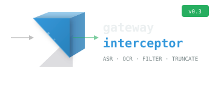
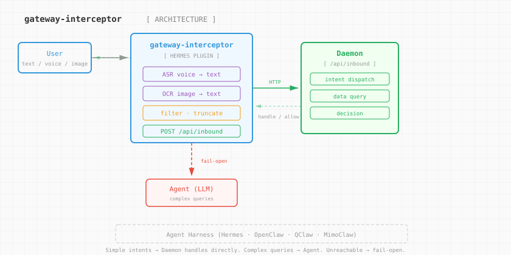
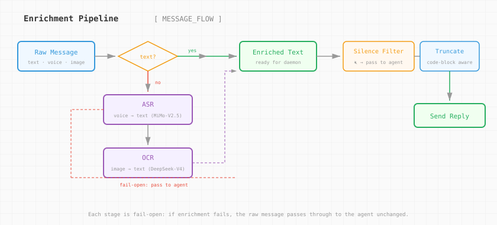

# gateway-interceptor

<p align="center">
  
</p>

> [中文版本](README.zh-CN.md)

Universal IM message interception plugin for AI Agent harnesses.

Enriches inbound messages (voice → text via ASR, image → text via OCR) and routes them through a conforming gateway daemon for smart dispatch — simple intents handled directly, complex queries pass through to the agent.

## Architecture

<p align="center">
  
</p>

## Two Abstraction Layers

### Harness Side (who loads this plugin)

The plugin registers a `pre_gateway_dispatch` hook — the Hermes convention. Other harnesses adapt the hook name in `register()`:

| Harness | Hook Mechanism | Adaptation |
|---------|---------------|------------|
| **Hermes Agent** | `ctx.register_hook("pre_gateway_dispatch", cb)` | Works out of the box |
| **OpenClaw** | Plugin loader TBD | Implement `register(ctx)` for OpenClaw's hook system |
| **QClaw** | Plugin loader TBD | Same pattern |
| **MimoClaw** | Plugin loader TBD | Same pattern |

The hook contract is harness-agnostic:

```python
def hook(event, gateway, **kwargs) -> {"action": "skip"} | {"action": "allow"} | None
```

### Daemon Side (what this plugin calls)

Any HTTP service implementing `POST /api/inbound`:

```
Request:
{
    "text": "user message (after ASR/OCR enrichment)",
    "user_id": "12345",
    "chat_id": "channel-789",
    "chat_type": "dm | group",
    "platform": "qqbot | telegram | discord | ..."
}

Response:
{"action": "handle", "reply": "daemon's answer"}      → plugin replies, agent skips
{"action": "handle", "replies": ["part1", "part2"]}   → multi-part reply
{"action": "allow"}                                    → pass to agent
```

Implementing this contract is all a daemon needs. Secretary is the reference implementation; you can build your own with any stack.

## Media Enrichment Pipeline

<p align="center">
  
</p>

Messages go through a three-stage enrichment before hitting the daemon:

```
Raw message
    │
    ├─ Has text? → use text directly
    │
    ├─ Has voice? → ASR (speech-to-text)
    │   └─ Download audio → ffmpeg convert → POST /v1/audio/transcriptions
    │      Models: MiMo-V2.5-ASR (fallback chain, configurable)
    │
    ├─ Has image? → OCR (image-to-text)
    │   └─ Download image → base64 → POST /v1/chat/completions (vision)
    │      Models: deepseek-v4-flash (fallback chain, configurable)
    │
    └─ None of above → pass to agent (let agent handle natively)
```

Each stage is fail-open: if ASR/OCR fails, the message passes through to the agent unchanged.

## Install

### Copy into harness plugins directory

```bash
# Global (all profiles)
cp __init__.py plugin.yaml ~/.hermes/plugins/gateway-interceptor/

# Per-profile
cp __init__.py plugin.yaml ~/.hermes/profiles/main/plugins/gateway-interceptor/
```

### Symlink (development)

```bash
ln -sf /path/to/secretary-gateway ~/.hermes/plugins/gateway-interceptor
```

### Install script

```bash
./install.sh                    # global copy
./install.sh --profile main     # per-profile copy
./install.sh --symlink          # symlink mode
```

Restart the harness to load the plugin.

## Configuration

### Daemon Connection

| Variable | Default | Description |
|----------|---------|-------------|
| `GATEWAY_DAEMON_URL` | `http://127.0.0.1:8901` | Gateway daemon HTTP address |
| `GATEWAY_DAEMON_TIMEOUT` | `3` | API call timeout (seconds) |
| `GATEWAY_DAEMON_ENDPOINT` | `/api/inbound` | Inbound message endpoint path |
| `GATEWAY_INTERCEPT_PLATFORMS` | `qqbot` | Platforms to intercept (comma-separated, empty=all) |

> Backward compat: `SECRETARY_GATEWAY_URL`, `SECRETARY_TIMEOUT`, `SECRETARY_INTERCEPT_PLATFORMS` still work.

### ASR (Voice → Text)

| Variable | Default | Description |
|----------|---------|-------------|
| `ASR_API_BASE` | `$NEWAPI_API_BASE` | OpenAI-compatible audio transcription API |
| `ASR_API_KEY` | `$NEWAPI_API_KEY` | API key |
| `ASR_MODELS` | `MiMo-V2.5-ASR` | Model fallback chain (comma-separated) |
| `ASR_TIMEOUT` | `60` | Transcription timeout (seconds) |
| `ASR_LANGUAGE` | `zh` | Language hint for ASR |

Voice pipeline: download audio → ffmpeg convert to WAV (16kHz mono) → `POST /v1/audio/transcriptions` (multipart). Falls back to original format if ffmpeg unavailable.

Supported audio formats: `.wav`, `.mp3`, `.ogg`, `.opus`, `.amr`, `.silk`, `.flac`, `.m4a`, `.webm`

### OCR (Image → Text)

| Variable | Default | Description |
|----------|---------|-------------|
| `VISION_API_BASE` | `$NEWAPI_API_BASE` | OpenAI-compatible vision API |
| `VISION_API_KEY` | `$NEWAPI_API_KEY` | API key |
| `OCR_MODELS` | `deepseek-v4-flash,deepseek-v4-pro` | Model fallback chain |
| `OCR_TIMEOUT` | `30` | OCR timeout (seconds) |

## Requirements

- **Python** ≥ 3.9
- **requests** (only external dependency)
- A running **gateway daemon** implementing `POST /api/inbound`
- **ffmpeg** (optional, for voice format conversion)
- Vision API (optional, for OCR)
- ASR API (optional, for voice transcription)

## Design Principles

- **Universal**: Works with any Agent harness and any conforming daemon.
- **Self-contained**: Zero dependency on daemon's Python package.
- **Fail-open**: Daemon unreachable, ASR fail, OCR fail → message passes to agent. Nothing is lost.
- **No LLM in hot path**: Plugin does enrichment only; intent dispatch lives in the daemon.
- **Fallback chains**: Both ASR and OCR try multiple models in order before giving up.

## Acknowledgments

This project incorporates code and design patterns derived from
[Hermes Agent](https://github.com/NousResearch/hermes-agent) by Nous Research.

| Function | Source | Purpose |
|----------|--------|---------|
| `utf16_len()` | `gateway/platforms/base.py` | Telegram message length in UTF-16 code units |
| `_prefix_within_utf16_limit()` | `gateway/platforms/base.py` | Safe UTF-16 truncation (surrogate-pair aware) |
| `_custom_unit_to_cp()` | `gateway/platforms/base.py` | Binary search for custom length unit boundaries |
| `truncate_message()` | `gateway/platforms/base.py` | Code-block-aware message splitting with chunk indicators |
| `_SILENCE_NARRATION` | `gateway/delivery.py` | Silence narration filter (suppresses `silent`, `🔇`, etc.) |

These functions are pure, zero-dependency, and extracted verbatim or adapted
with minimal changes. They enhance the core message pipeline without adding
any runtime overhead or external dependencies.

## License

MIT

## Related Projects

- [Secretary](https://github.com/petrezhu/secretary) — Reference daemon implementation
- [Hermes Agent](https://github.com/nousresearch/hermes-agent) — Reference harness
