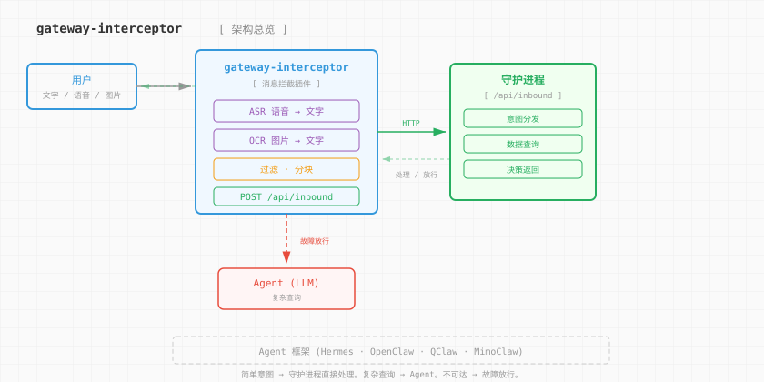

# gateway-interceptor

<p align="center">
  
</p>

> **≈0 延迟 · 0 tokens · 全模态 · <50MB 内存 · 全框架适配**
>
> 一个 [hermes-agent](https://github.com/NousResearch/hermes-agent) 插件，[Secretary（沉淀式冷智能体）](https://github.com/petrezhu/secretary) 的消息入口。在 LLM Agent 之前拦截消息，用规则能处理的直接回复，处理不了的才唤醒 Agent。

<p>
<a href="#-快速开始"></a>
<a href="#-快速开始"></a>
<a href="#-快速开始"></a>
<a href="#-快速开始"></a>
<a href="#-快速开始"></a>
<a href="LICENSE"></a>
</p>

[English](README.md) | **简体中文**

---

## 🎯 解决什么问题

Agent 框架（Hermes/OpenClaw/QClaw/MimoClaw）的主链路是：**用户消息 → LLM 推理 → 工具调用 → 回复**。这对复杂问题是对的，但对以下场景是浪费：

[Secretary](https://github.com/petrezhu/secretary) 是一个**沉淀式冷智能体**——不靠 LLM 推理，靠规则库 + 数据积累运转。监控、督导、财富分析、早安简报，全部确定性执行，零 token 消耗。gateway-interceptor 是它的消息入口，负责在 Agent（热智能）之前拦截消息，能用冷智能处理的直接处理，处理不了的才唤醒热智能。

| 场景 | Agent 主链路 | gateway-interceptor |
|------|-------------|-------------------|
| "你好" | LLM 推理 → 消耗 token → 2-5 秒 | 纯正则匹配 → 0 token → <50ms |
| 发一张持仓截图 | Agent 调用视觉工具 → 多轮交互 | OCR 提取文字 → 直接路由 |
| 发一段语音 | Agent 无法直接理解音频 | ASR 转文字 → 意图匹配 → 回复 |
| "待办" | LLM 理解意图 → 查询数据库 | 正则命中 → 直接查 → 直接回 |

**越用越省 tokens**：高频简单意图被拦截后，Agent 的 LLM 调用次数直线下降。100 条消息里，可能 70 条被拦截，只有 30 条唤醒 Agent。

## ✨ 核心特性

<table>
<tr><td><b>≈0 延迟响应</b></td><td>纯正则 + 关键词匹配，无 LLM 推理，<50ms 决策。用户感知"秒回"。</td></tr>
<tr><td><b>0 token 消耗</b></td><td>意图匹配不调用任何 LLM API。ASR/OCR 只在需要时触发，且用最便宜的模型。</td></tr>
<tr><td><b>全模态输入</b></td><td>文字直接处理。语音通过 ASR（MiMo-V2.5-ASR）转文字。图片通过 OCR（DeepSeek-V4）提取文字。统一输出为文本后路由。</td></tr>
<tr><td><b><50MB 内存</b></td><td>单文件插件，唯一依赖 requests。不常驻内存，不持有状态，不加载模型。</td></tr>
<tr><td><b>全框架适配</b></td><td>Hermes Agent 开箱即用。OpenClaw/QClaw/MimoClaw 通过 <code>register(ctx)</code> 适配。守护进程侧只需实现 <code>POST /api/inbound</code>。</td></tr>
<tr><td><b>故障放行设计</b></td><td>守护进程不可达、ASR 失败、OCR 失败 → 消息原样放行给 Agent。绝不丢消息。</td></tr>
<tr><td><b>热插拔中间件</b></td><td>Symlink 安装，改代码即生效。不修改框架源码，不 fork 任何项目。升级框架不影响插件。</td></tr>
<tr><td><b>生产级消息处理</b></td><td>代码块感知分块（不劈开 <code>```</code>）、Telegram UTF-16 长度计算、静默占位符过滤（🔇）、分段标记（1/3）。</td></tr>
</table>

## 🧭 定位对比

- **vs 直接用 Agent 处理所有消息：** Agent 的 LLM 推理对"你好"、"待办"是过度工程化。gateway-interceptor 用纯正则 <50ms 拦截，省 token 省延迟。Agent 只处理真正需要推理的复杂查询。
- **vs LiteLLM 等 LLM 网关：** LiteLLM 拦截的是 API 请求（prompt → completion），gateway-interceptor 拦截的是 IM 消息（用户消息 → 意图分发）。层级不同，不冲突。
- **vs Botpress/Rasa 等对话平台：** 那些是重量级全栈平台。gateway-interceptor 是一个 841 行的单文件插件，不引入任何框架。

```
                  轻量 ←──────────────────→ 重量
                    │
  消息拦截 ──────── ● gateway-interceptor（我们）
                    │
  LLM 代理 ──────── │ ──── LiteLLM
                    │
  对话平台 ──────── │ ──────────── Botpress / Rasa
                    │
  Agent 运行时 ──── │ ────────────────── OpenClaw / Hermes
                    │
  工作流平台 ────── │ ──────────────────────── Dify / n8n
```

---

## 🏛️ 架构总览

<p align="center">
  
</p>

**一句话契约：** `register(ctx)` 注册 `pre_gateway_dispatch` 钩子；插件拦截消息后进行增强（ASR/OCR），调用守护进程的 `POST /api/inbound`，然后直接回复或放行给 Agent。**框架：0 行代码改动。**

### 组件地图

```
secretary-gateway/
├── __init__.py                     核心：钩子注册 + ASR 管线 + OCR 管线
│                                     + Hermes 工具函数 (utf16/分块/静默过滤)
│                                     + 消息路由 (处理/放行/故障放行)
├── plugin.yaml                     Hermes 插件清单 (名称、版本、钩子声明)
├── pyproject.toml                  Python 包元数据 + hatchling 构建配置
├── install.sh                      安装脚本 (复制/符号链接, 全局/指定 profile)
├── README.md                       英文文档
├── README.zh-CN.md                 中文文档（本文件）
├── SPEC.md                         功能规格 (24 条用户故事 + 实现决策)
├── LICENSE                         MIT 许可证
├── docs/images/
│   ├── logo.svg                    3D 楔形 Logo
│   ├── architecture.svg            架构图（英文）
│   ├── architecture.zh-CN.svg      架构图（中文）
│   ├── pipeline.svg                增强管线图（英文）
│   └── pipeline.zh-CN.svg          增强管线图（中文）
└── tests/
    ├── test_pure_functions.py      纯函数测试：utf16/分块/静默过滤/URL (69 条)
    ├── test_config.py              配置回退链测试：环境变量优先级 + 默认值 (16 条)
    └── test_hook.py                钩子行为测试：处理/放行/故障放行 (13 条)
```

<details>
<summary><b>深度解读——分发契约（面向接手此仓库的开发者）</b></summary>

1. **入口点，不修改框架源码。** `register(ctx)` 注册 `pre_gateway_dispatch` 钩子。对于被拦截平台的消息，钩子负责增强和路由。

2. **媒体增强是一条管线。** 原始消息 → 有文字？→ 直接使用。有语音？→ ASR（下载 → ffmpeg 转码 → `POST /v1/audio/transcriptions`）。有图片？→ OCR（下载 → base64 编码 → `POST /v1/chat/completions`）。每一级都是故障放行。

3. **守护进程契约是 HTTP。** `POST /api/inbound`，请求体 `{text, user_id, chat_id, chat_type, platform}`。响应：`{action: "handle", reply: "..."}` 或 `{action: "allow"}`。

4. **回复处理是多阶段的。** 静默过滤器移除 `silent`/`🔇`/`no reply`。`truncate_message()` 在代码块边界处分块，附带分段标记 `(1/3)`。回复通过网关适配器发送（事件循环线程上 fire-and-forget）。

5. **配置使用回退链。** `GATEWAY_DAEMON_URL` → `SECRETARY_GATEWAY_URL` → 默认值。所有环境变量都有向后兼容的别名。模块级常量在 import 时读取。

6. **Hermes 工具函数是纯函数。** `utf16_len()`、`_prefix_within_utf16_limit()`、`_custom_unit_to_cp()`、`truncate_message()` —— 全部源自 Hermes Agent 的 `gateway/platforms/base.py`。零依赖，零副作用。

</details>

---

## 🚀 快速开始

### 1. 安装插件

```bash
# 方式一：符号链接（推荐开发模式）
ln -sf /path/to/secretary-gateway ~/.hermes/plugins/gateway-interceptor

# 方式二：复制
cp __init__.py plugin.yaml ~/.hermes/plugins/gateway-interceptor/

# 方式三：安装脚本
./install.sh                    # 全局复制
./install.sh --profile main     # 指定 profile
./install.sh --symlink          # 符号链接模式
```

重启框架加载插件。

### 2. 配置环境变量

```bash
# 守护进程连接（非默认地址时需要配置）
export GATEWAY_DAEMON_URL="http://127.0.0.1:8901"

# ASR（可选——用于语音消息）
export ASR_API_BASE="http://127.0.0.1:3300/v1"
export ASR_MODELS="MiMo-V2.5-ASR"

# OCR（可选——用于图片消息）
export OCR_MODELS="deepseek-v4-flash,deepseek-v4-pro"

# 平台过滤
export GATEWAY_INTERCEPT_PLATFORMS="qqbot"  # 留空则拦截所有平台
```

### 3. 验证

```bash
# 运行测试
python3 -m pytest tests/ -v

# 检查插件加载
python3 -c "from __init__ import register; print('✅ 插件加载成功')"
```

---

## ⚙️ 配置参考

### 守护进程连接

| 变量 | 默认值 | 说明 |
|------|--------|------|
| `GATEWAY_DAEMON_URL` | `http://127.0.0.1:8901` | 守护进程 HTTP 地址 |
| `GATEWAY_DAEMON_TIMEOUT` | `3` | API 调用超时（秒） |
| `GATEWAY_DAEMON_ENDPOINT` | `/api/inbound` | 入站消息端点路径 |
| `GATEWAY_INTERCEPT_PLATFORMS` | `qqbot` | 拦截的平台（逗号分隔，留空=全部） |

> 向后兼容：`SECRETARY_GATEWAY_URL`、`SECRETARY_TIMEOUT`、`SECRETARY_INTERCEPT_PLATFORMS` 仍然有效。

### ASR（语音转文字）

| 变量 | 默认值 | 说明 |
|------|--------|------|
| `ASR_API_BASE` | `$NEWAPI_API_BASE` | OpenAI 兼容的音频转录 API |
| `ASR_API_KEY` | `$NEWAPI_API_KEY` | API 密钥 |
| `ASR_MODELS` | `MiMo-V2.5-ASR` | 模型回退链（逗号分隔） |
| `ASR_TIMEOUT` | `60` | 转录超时（秒） |
| `ASR_LANGUAGE` | `zh` | ASR 语言提示 |

语音管线：下载音频 → ffmpeg 转 WAV（16kHz 单声道）→ `POST /v1/audio/transcriptions`（multipart）。ffmpeg 不可用时降级到原始格式。

支持的音频格式：`.wav`、`.mp3`、`.ogg`、`.opus`、`.amr`、`.silk`、`.flac`、`.m4a`、`.webm`

### OCR（图片转文字）

| 变量 | 默认值 | 说明 |
|------|--------|------|
| `VISION_API_BASE` | `$NEWAPI_API_BASE` | OpenAI 兼容的视觉 API |
| `VISION_API_KEY` | `$NEWAPI_API_KEY` | API 密钥 |
| `OCR_MODELS` | `deepseek-v4-flash,deepseek-v4-pro` | 模型回退链 |
| `OCR_TIMEOUT` | `30` | OCR 超时（秒） |

---

## 🧪 测试

```bash
# 全部测试
python3 -m pytest tests/ -v

# 指定测试文件
python3 -m pytest tests/test_pure_functions.py -v   # 69 条
python3 -m pytest tests/test_config.py -v           # 16 条
python3 -m pytest tests/test_hook.py -v             # 13 条

# 代码检查
ruff check __init__.py --select E,F,W,I
```

**共 98 条测试，运行时间 0.27 秒。**

---

## 📦 依赖

- **Python** ≥ 3.9
- **requests**（唯一外部依赖）
- 运行中的**守护进程**（实现 `POST /api/inbound`）
- **ffmpeg**（可选，用于语音格式转换）
- 视觉 API（可选，用于 OCR）
- ASR API（可选，用于语音转录）

---

## 🙏 致谢

本项目吸纳了 [Hermes Agent](https://github.com/NousResearch/hermes-agent)（Nous Research）的代码和设计模式。

| 函数 | 来源 | 用途 |
|------|------|------|
| `utf16_len()` | `gateway/platforms/base.py` | Telegram 消息按 UTF-16 code unit 计长 |
| `_prefix_within_utf16_limit()` | `gateway/platforms/base.py` | 安全 UTF-16 截断（surrogate-pair 感知） |
| `_custom_unit_to_cp()` | `gateway/platforms/base.py` | 自定义长度单位的二分查找 |
| `truncate_message()` | `gateway/platforms/base.py` | 代码块感知分块 + 分段标记 |
| `_SILENCE_NARRATION` | `gateway/delivery.py` | 静默占位符过滤（`silent`、`🔇` 等） |

这些函数是纯函数、零依赖，原样提取或最小改动适配，不增加运行时开销。

---

## 📄 许可证

MIT

## 🔗 相关项目

- [Secretary](https://github.com/petrezhu/secretary) — 沉淀式冷智能体（规则引擎 + 数据积累，0 LLM 调用）
- [Hermes Agent](https://github.com/nousresearch/hermes-agent) — LLM 热智能体（推理引擎）
